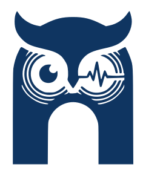

# Sally: Wearable Device

This project is a core component of the [cp_wearable_ai](https://github.com/osugiw/cp_wearable_ai.git) ecosystem.

<table border="0">
  <tr>
    <td width="50%" align="center">
      
    </td>
    <td width="50%" align="center">
      
    </td>
  </tr>
</table>

Information retention and the cognitive load of tracking professional interactions represent significant barriers to productivity. This paper introduces a necklace-form wearable assistant designed to streamline task management through intelligent conversation capture and context analysis. Utilizing a privacy-centric edge-computing architecture, the device transmits audio to a localized Raspberry Pi server for secure processing.
Advanced speech-to-text and small language models synthesize raw transcriptions into structured, context-aware summaries and personalized journals. A core contribution is the automated extraction of "action items" from natural dialogue, which the system uses to notify users and facilitate task execution via a mobile application. Technical evaluations demonstrate a 90\% transcription accuracy and optimized power management, achieving an 9.52-hour operational battery life. By automating the transition from verbal commitments to digital tasks, the system reduces the cognitive effort required for recall and interaction review, transforming ambient conversation into organized, actionable productivity insights.

## 🚀 The Vision

Our goal is to provide a seamless "second brain" that lives as your necklace. By integrating continuous audio capture, the device doesn't just listen—it understands the physical and social context of your day to provide proactive support.

## 🚀 The Vision

Our goal is to provide a seamless "second brain" that lives as your necklace. By integrating continuous audio capture with biometric monitoring, the device doesn't just listen—it understands the physical and social context of your day to provide proactive support.

## 📋 Requirements

This repo contains 3D design for the closure and can be opened using Solidworks minimum version 2024. The **.stl** files can also be used for printing on 3D Printer.

## 👥 Project Team

- **Sugiarto Wibowo** ([sw183@rice.edu](mailto:sw183@rice.edu))* — *Lead Developer*
- **Jeeven Balasubramaniam** ([jb310@rice.edu](mailto:jb310@rice.edu))** — *Collaborator*

### 🎓 Supervision

- **Nakul Garg** ([ng83@rice.edu](mailto:ng83@rice.edu))* — *Project Supervisor*

**Affiliation:** *Rice University, Houston, Texas, USA*

> <small>* Electrical and Computer Engineering Department</small>
> 
> 
> <small>** Data Science Department</small>
>